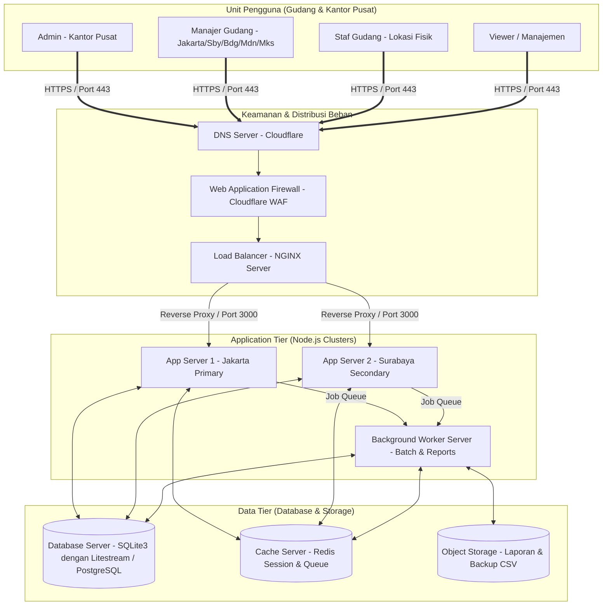

# Dokumen Arsitektur Perangkat Keras dan Infrastruktur
## SmartStock Pro - PT Maju Bersama Digital

### 1. Topologi Sistem & Infrastruktur Jaringan

Sistem "SmartStock Pro" dirancang menggunakan arsitektur **Three-Tier (Presentation, Application, and Data Tier)** untuk menjamin pemisahan fungsi, tingkat keamanan tinggi, dan kemudahan dalam melakukan penskalaan horizontal maupun vertikal.

Berikut adalah gambaran topologi jaringan dan server yang direkomendasikan untuk PT Maju Bersama Digital:

#### Deskripsi Aliran Sistem:
1. **Presentation Tier (DNS & WAF)**:
   Seluruh permintaan pengguna masuk melalui **Cloudflare DNS** dan diproteksi oleh **Cloudflare WAF** untuk menyaring serangan siber seperti DDoS, SQL Injection, XSS, dan serangan brute force login.
2. **Reverse Proxy & Load Balancing (NGINX)**:
   **NGINX** bertindak sebagai Load Balancer untuk mendistribusikan beban secara *round-robin* ke klaster Application Server, serta menangani terminasi enkripsi SSL/TLS secara efisien.
3. **Application Tier (Node.js Express)**:
   Terdiri dari klaster server aplikasi Node.js yang berjalan di beberapa *instance* menggunakan process manager (PM2) untuk memaksimalkan pemanfaatan multi-core CPU. Satu server didekasikan khusus sebagai **Background Worker Server** untuk menangani eksekusi batch import CSV dan kompilasi laporan stok besar tanpa mengganggu responsivitas API/UI server utama.
4. **Data Tier**:
   - **Database Relasional**: Menggunakan SQLite3 untuk deployment awal skala menengah, yang disinkronkan secara real-time ke replika cadangan menggunakan alat replikasi stream (seperti *Litestream*) untuk pencadangan bencana (Disaster Recovery). Jika volume transaksi melonjak drastis, arsitektur ini dapat dimigrasikan ke PostgreSQL tanpa mengubah kode backend secara masif.
   - **Redis Cache & Queue**: Digunakan untuk menyimpan data session pengguna (dengan timeout otomatis) dan mengelola antrean pekerjaan (job queue) untuk sinkronisasi paralel antar gudang.
   - **Object Storage**: Penyimpanan terdistribusi untuk menyimpan file CSV hasil ekspor laporan inventaris.

---

### 2. Spesifikasi Minimum Server (Rekomendasi)

Untuk menjamin sistem berjalan dengan *zero lag* dan mampu menangani transaksi konkuren tinggi dari 5 gudang besar di Indonesia, berikut adalah spesifikasi server yang direkomendasikan:

#### A. Web & Application Server (Primary & Secondary)
Spesifikasi ini ditujukan untuk melayani request HTTP dari pengguna secara real-time.
- **Prosesor (CPU)**: 4 Cores, 2.5 GHz Intel Xeon / AMD EPYC (atau AWS EC2 t3.xlarge)
- **RAM**: 8 GB DDR4 ECC
- **Penyimpanan (Storage)**: 50 GB SSD NVMe (Read/Write tinggi untuk I/O operasi yang cepat)
- **Sistem Operasi**: Linux Ubuntu Server 22.04 LTS (64-bit)
- **Bandwidth**: Minimal 100 Mbps (Unmetered) dengan latensi rendah untuk area Indonesia (Hosting di Data Center Jakarta / Singapore)

#### B. Database Server
Spesifikasi ini dioptimalkan untuk memproses query SQL, *exclusive transactions* saat transfer stok, dan pencatatan audit log berkecepatan tinggi.
- **Prosesor (CPU)**: 4 Cores, 3.0 GHz+ (Spesifikasi CPU yang tinggi sangat krusial untuk performa single-thread SQLite)
- **RAM**: 16 GB DDR4 (RAM besar memastikan seluruh database SQLite / PostgreSQL *index* berada di dalam RAM cache)
- **Penyimpanan (Storage)**: 100 GB SSD NVMe Enterprise Grade (IOPS minimal 10,000)
- **Bandwidth**: 1 Gbps (Koneksi lokal internal/Private Network ke Application Server)

#### C. Background Worker Server (Opsional/Direkomendasikan untuk Skalabilitas)
Server ini digunakan untuk menangani tugas-tugas berat di latar belakang (*import CSV* dan *generate report*).
- **Prosesor (CPU)**: 4 Cores, 2.5 GHz
- **RAM**: 8 GB DDR4
- **Penyimpanan (Storage)**: 50 GB SSD SATA III
- **Bandwidth**: 100 Mbps

---

### 3. Keamanan Infrastruktur Jaringan

- **SSL/TLS 1.3**: Enkripsi penuh untuk semua lalu lintas data antara browser pengguna dan load balancer menggunakan protokol TLS terkuat saat ini.
- **Private Subnet**: Database server dan Background Worker ditempatkan di dalam *private subnet* di balik Virtual Private Cloud (VPC), sehingga tidak dapat diakses langsung dari internet publik. Akses hanya diizinkan melalui port khusus dari Application Server.
- **Bastion Host / VPN**: Untuk akses administratif ke server (SSH/Maintenance), wajib melalui koneksi VPN korporat yang aman atau Bastion Host dengan autentikasi berbasis kunci SSH dan autentikasi dua faktor (2FA).
