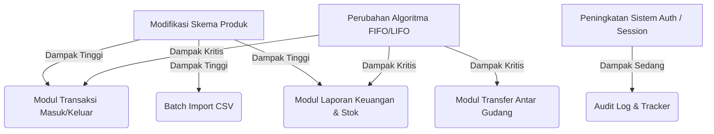

# Dokumen Rencana Migrasi, Cutover, dan Pembaharuan Perangkat Lunak
## SmartStock Pro - PT Maju Bersama Digital

### 1. Rencana Migrasi Data (Dari Spreadsheet ke SmartStock Pro)

PT Maju Bersama Digital saat ini mengandalkan pencatatan inventaris manual berbasis Microsoft Excel / Google Sheets. Migrasi data yang aman dan terstruktur sangat krusial untuk mencegah duplikasi data atau kehilangan histori transaksi stok.

#### A. Strategi Migrasi Data
Migrasi akan dilakukan dalam 3 tahap (Extract, Transform, Load - ETL):
1. **Ekstraksi (Extract)**: Mengekspor data dari spreadsheet lama ke dalam format file CSV standar UTF-8.
2. **Transformasi & Pembersihan (Transform)**:
   - Menghapus baris kosong, mendeteksi nilai duplikat pada kode SKU produk, dan memformat ulang penulisan nama kategori.
   - Mengonversi data stok awal menjadi struktur *Stock Batch* (menghubungkan kuantitas awal dengan harga pembelian asal dan tanggal terima).
3. **Pemuatan (Load)**: Mengimpor file CSV ke database SmartStock Pro menggunakan modul *Batch Import* paralel yang berjalan di Background Worker.

#### B. Pemetaan Kolom Data (Field Mapping)

Tabel berikut menunjukkan pemetaan dari spreadsheet lama ke tabel database baru SmartStock Pro:

| Nama Kolom Spreadsheet Lama | Kolom Target Database Baru | Tipe Data | Aturan Validasi / Transformasi |
| :--- | :--- | :--- | :--- |
| **Kode Produk** | `products.sku` | TEXT (VARCHAR) | Wajib diisi, unik, huruf besar, tanpa spasi. |
| **Nama Barang** | `products.name` | TEXT (VARCHAR) | Wajib diisi, minimal 3 karakter. |
| **Kategori** | `categories.name` | TEXT (VARCHAR) | Jika kategori belum ada di database, buat kategori baru otomatis dan ambil `id`-nya. |
| **Supplier Utama** | `suppliers.name` | TEXT (VARCHAR) | Dicocokkan dengan tabel `suppliers`. Jika tidak ditemukan, diarahkan ke supplier "Umum/Default". |
| **Stok Minimum** | `products.min_stock` | INTEGER | Default: 10 jika kosong atau tidak valid. |
| **Harga Jual Satuan** | `products.price` | REAL (DOUBLE) | Wajib berupa angka positif (> 0). |
| **Stok Gudang Jakarta** | `stock_batches.remaining_qty` | INTEGER | Jumlah stok awal untuk Gudang Jakarta (ID: 1). |
| **Stok Gudang Surabaya**| `stock_batches.remaining_qty` | INTEGER | Jumlah stok awal untuk Gudang Surabaya (ID: 2). |
| **Stok Gudang Bandung** | `stock_batches.remaining_qty` | INTEGER | Jumlah stok awal untuk Gudang Bandung (ID: 3). |
| **Stok Gudang Medan**   | `stock_batches.remaining_qty` | INTEGER | Jumlah stok awal untuk Gudang Medan (ID: 4). |
| **Stok Gudang Makassar** | `stock_batches.remaining_qty` | INTEGER | Jumlah stok awal untuk Gudang Makassar (ID: 5). |

#### C. Validasi Data Pasca-Migrasi
Untuk menjamin integritas data 100% setelah proses migrasi selesai, sistem akan menjalankan skrip verifikasi otomatis yang membandingkan:
- **Jumlah Record**: Memastikan jumlah baris produk yang berhasil diimpor sama dengan jumlah produk unik di spreadsheet.
- **Konsistensi Saldo Stok**: Menghitung total stok per gudang di database (`SUM(remaining_qty)`) dan membandingkannya dengan jumlah total kolom stok di spreadsheet asli.
- **Deteksi Anomali**: Menampilkan laporan kesalahan jika ada produk yang memiliki stok tetapi harga beli atau SKU-nya tidak terdefinisi.

#### D. Rollback Plan (Rencana Pembatalan)
Jika terjadi kegagalan sistem kritis saat migrasi data (misalnya crash server atau korupsi database):
1. **Langkah 1**: Hentikan seluruh akses tulis ke sistem baru (aktifkan Maintenance Mode).
2. **Langkah 2**: Jalankan skrip pembersihan untuk menghapus semua transaksi database yang dibuat selama sesi migrasi berjalan (`ROLLBACK` transaksi).
3. **Langkah 3**: Pulihkan database ke *backup snapshot* terakhir yang diambil tepat sebelum proses migrasi dimulai.
4. **Langkah 4**: Gunakan kembali spreadsheet lama untuk operasional sementara hingga masalah teknis diidentifikasi dan diselesaikan di lingkungan staging.

---

### 2. Dokumen Cutover Plan (Rencana Peralihan)

Cutover Plan adalah panduan langkah demi langkah untuk menghentikan penggunaan sistem lama (spreadsheet) dan secara resmi mengaktifkan SmartStock Pro untuk operasional harian.

#### A. Jadwal Timeline Peralihan
Peralihan disarankan dilakukan pada akhir pekan (Sabtu pukul 20.00 WIB hingga Minggu pukul 22.00 WIB) saat aktivitas pengiriman barang di 5 gudang sedang berhenti.

```text
[Sabtu 20:00 WIB] ──> [Sabtu 21:00 WIB] ──> [Minggu 02:00 WIB] ──> [Minggu 14:00 WIB] ──> [Senin 08:00 WIB]
 Freeze Spreadsheet      Ekstraksi & Backup      Load ke SmartStock       UAT & Verifikasi         Sistem GO-LIVE!
```

#### B. Checklist Pra-Cutover
- [ ] Menyosialisasikan jadwal pemeliharaan dan pembekuan data (*data freeze*) ke seluruh kepala gudang dan staf.
- [ ] Memastikan infrastruktur server produksi SmartStock Pro telah terkonfigurasi dengan SSL aktif.
- [ ] Membuat backup final dari semua spreadsheet inventaris aktif dari 5 gudang.
- [ ] Memverifikasi akun pengguna awal (Admin, Manajer, Staf) telah siap di database baru.

#### C. Langkah-Langkah Cutover
1. **Langkah 1 (Pembekuan Data)**: Kunci semua spreadsheet inventaris lama menjadi *Read-Only*. Mulai pukul 20:00 WIB, tidak boleh ada pencatatan transaksi baru di luar sistem SmartStock Pro.
2. **Langkah 2 (Backup Database)**: Lakukan backup awal database kosong SmartStock Pro.
3. **Langkah 3 (Eksekusi ETL)**: Jalankan modul batch import data migrasi.
4. **Langkah 4 (Verifikasi Rekonsiliasi)**: Staf keuangan dan tim logistik membandingkan laporan stok fisik akhir dengan data yang tampil di dashboard SmartStock Pro.
5. **Langkah 5 (Aktivasi Sistem)**: Nonaktifkan Maintenance Mode pada aplikasi SmartStock Pro. Sistem siap menerima transaksi real-time.

#### D. Verifikasi Pasca-Cutover
Setiap perwakilan dari 5 kota wajib melakukan satu transaksi uji coba (masuk dan keluar) di kota masing-masing pada hari Minggu sore untuk memverifikasi bahwa sinkronisasi data paralel dan audit log berfungsi dengan benar di bawah beban jaringan nyata.

---

### 3. Skenario Pembaharuan (Update) Perangkat Lunak & Git

Untuk memastikan pengembangan fitur baru di masa mendatang tidak merusak stabilitas sistem yang sudah berjalan (*zero downtime deployment*), tim developer wajib mengikuti panduan Git Flow berikut:

#### A. Alur Kerja Git (Git Workflow)
- **Cabang Utama (`main`)**: Menyimpan kode produksi yang stabil dan teruji penuh. Setiap rilis baru diberi tag versi (misalnya `v1.0.0`, `v1.1.0`).
- **Cabang Pengembangan (`develop`)**: Cabang integrasi untuk fitur-fitur baru yang sedang dikembangkan dan diuji coba oleh tim QA.
- **Cabang Fitur (`feature/nama-fitur`)**: Dibuat dari `develop` untuk menulis fitur baru (misalnya `feature/barcode-scanner`). Setelah selesai, cabang ini digabungkan kembali ke `develop` melalui *Pull Request (PR)* dengan proses *Code Review*.

#### B. Skema Deployment Tanpa Gangguan (CI/CD)
1. **Blue-Green Deployment**: Menggunakan dua lingkungan server produksi identik (Blue dan Green). Rilis baru dideploy ke server Green, diuji, dan jika dinyatakan aman, Load Balancer (NGINX) akan langsung mengalihkan rute traffic pengguna dari Blue ke Green dalam hitungan milidetik.
2. **Database Migration Scripts**: Setiap penambahan kolom atau tabel baru di database wajib menggunakan file skrip migrasi terpisah (misalnya `migration_v1.1.sql`). Skrip ini harus bersifat *backward compatible* (tidak menghapus kolom lama yang masih digunakan oleh versi software sebelumnya).

---

### 4. Analisis Dampak Perubahan (Impact Analysis)

Jika terjadi perubahan atau penambahan fitur pada satu modul, berikut adalah analisis dampaknya terhadap modul-modul lain di SmartStock Pro:



#### Detail Analisis Dampak:
1. **Perubahan Skema Produk (Misal: Penambahan Field Baru)**:
   - *Dampak*: **Tinggi**. Modul Batch Import CSV wajib diperbarui untuk memetakan kolom baru tersebut. Form CRUD Produk di UI juga harus diperbarui agar admin dapat mengisi field tersebut.
   - *Langkah Mitigasi*: Buat nilai default (default value) pada tingkat database untuk kolom baru tersebut agar proses import lama tidak mengalami crash.
2. **Modifikasi Algoritma Perhitungan Stok (FIFO/LIFO)**:
   - *Dampak*: **Kritis**. Berdampak langsung pada Modul Transfer Antar Gudang dan Laporan Aset Inventaris. Kesalahan kecil dalam logika iterasi batch dapat menyebabkan *race conditions* atau stok bernilai negatif.
   - *Langkah Mitigasi*: Jalankan unit testing komprehensif (`test-fifo-lifo.js`) yang mensimulasikan ribuan transaksi sebelum melakukan merger kode ke cabang `main`.
3. **Pembaruan Sistem Autentikasi / Sesi**:
   - *Dampak*: **Sedang**. Mempengaruhi semua endpoint API karena setiap request memerlukan otorisasi token/session.
   - *Langkah Mitigasi*: Gunakan pengujian otomatis untuk memverifikasi bahwa akun dengan peran *Viewer* tetap diblokir dari akses menulis data di seluruh endpoint CRUD.
